# 최종관통프로젝트

### 개요

- final-pjt 제출주소
  https://lab.ssafy.com/shko0524/final-pjt.git
- Trello management
  https://trello.com/b/Agl03LfX/final-pjt

- 개발환경
  - Python 3.8 +
  - Django 3.2.12
  - Node LTS
  - Vue.js 2.6+
  - Django REST API 서버 & Vue.js
- 프로젝트 기간
  - 2022. 5. 17. (화) ~ 
                 2022. 5. 26. (목)
  - 발표 : 2022. 05. 27. (금)
- 필수 기능
  - 관리자 뷰
    - 영화 CRUD
    - 유저 관리
  - 영화 정보
    - DB Seeding ( 50개 이상 )
    - 영화 평점 CRUD
  - 영화 추천 알고리즘
    - 팀별 자유 알고리즘
  - 커뮤니티
    - 게시글, 댓글 CRUD ( 생성시간, 수정시간 필수 )
  - 기타
    - 최소 5개 이상의 URL 및 페이지 구성
    - HTTP Method / HTTP response status codes 적절히 구성

----

### 1. 팀원 정보 및 업무 분담 내역

<table>
    <tr>
    	<th style="text-align:center">고승효(팀장)</th>
        <th style="text-align:center">김애리</th>
    </tr>
    <tr>
    	<td>
        	
        </td>
        <td>
        	
        </td>
    </tr>
    <tr>
        <td colspan="2" style="text-align:center">
            프론트엔드 구현
        </td>
    </tr>
    <tr>
        <td>
            비선호 장르 + 좋아요 영화 기반 영화 추천 알고리즘 <br>
            영화별 한줄평 기능 구현 <br>
            커뮤니티 기능 구현 <br>
            비선호 장르 선택 기능 구현
        </td>
        <td>
            로그인/로그아웃/signup<br>
            개인프로필: 좋아요 영화, 작성 게시글 확인 기능 구현 
        </td>
    </tr>
    <tr>
    	<td colspan="2" style="text-align:center">
        	공통 작업
        </td>
    </tr>
    <tr>
    	<td colspan="2" style="text-align:center">
        	movie detail: 좋아요 기능 구현<br>
        </td>
    </tr>
    <tr>
        <td colspan="2" style="text-align:center">
            백엔드 구현
        </td>
    </tr>
    <tr>
        <td>
            Movie Serializer<br>
            비선호 장르 '싫어요' 구현
        </td>
        <td>
            TMDB 이용 dumpdata 받아오기<br>
            전체적인 모델링 및 serializer 보완<br>
            admin CRUD 구현<br>
            '좋아요' 기능 구현
        </td>
    </tr>
    <tr>
        <td colspan="2" style="text-align:center">
            공통 작업
        </td>
    </tr>
    <tr>
        <td colspan="2" style="text-align:center">
            serializer 구현
        </td>
    </tr>
</table>


### 2. 목표 서비스 구현 및 실제 구현 정도

#### - 목표 서비스

- 소셜 로그인 구현 (google, kakao, naver)
- 영화 정보 기반 추천 서비스★
  - 최초 로그인 시 추천 받기 싫은 영화 장르를 먼저 선택하고, default값 음수로 변경.
  - 이후 내가 본 영화를 기반으로 좋아요를 누르면 장르별로 점수 차등 부여하여 영화 추천. 
- 배우별 / 감독별 영화 추천 - 유저 좋아요 기반
- 커뮤니티 - 자유게시판 형식

#### - 구현

- 가상환경 생성 및 활성화

  ```bash
  $ python -m venv venv
  $ source venv/Scripts/activate
  ```

- requirment.txt 설치

  ```bash
  $ pip install -r requirment.txt
  ```

- 모델 생성 및 migration & migrate

  ```bash
  $ python manage.py makemigrations
  $ python manage.py migrate
  ```

- dumpdata 및 loaddata

  ```bash
  $ python -Xutf8 manage.py dumpdata --indent 4 movies.actor > actor.json
  $ python -Xutf8 manage.py dumpdata --indent 4 movies.derector > derector.json
  $ python -Xutf8 manage.py dumpdata --indent 4 movies.genre > genre.json
  $ python -Xutf8 manage.py dumpdata --indent 4 movies.popularmovie > popularmovie.json
  
  $ python manage.py loaddata movies/actor.json movies/director.json movies/genre.json movies/popularmovie.json
  $ python manage.py loaddata movies/popularmovie.json
  ```

- 영화 정보 기반 추천 서비스★
  - 최초 로그인 시 추천 받기 싫은 영화 장르를 먼저 선택하고, default값 음수로 변경.
  - 이후 내가 본 영화를 기반으로 좋아요를 누르면 장르별로 점수 차등 부여하여 영화 추천. 
- 배우별 / 감독별 영화 추천 - 유저 좋아요 기반
- 커뮤니티 - 자유게시판 형식


### 3. 데이터베이스 모델링 (ERD)


### 4. 필수 기능에 대한 설명

#### 1) 실제 구현 내용

- 관리자 뷰

  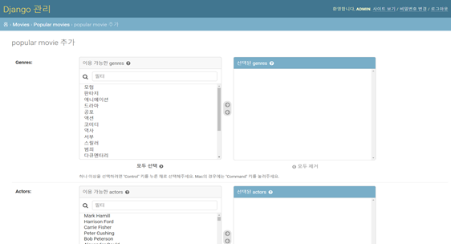

  => admin 계정으로 movie 정보 CRUD 설정

- accounts

  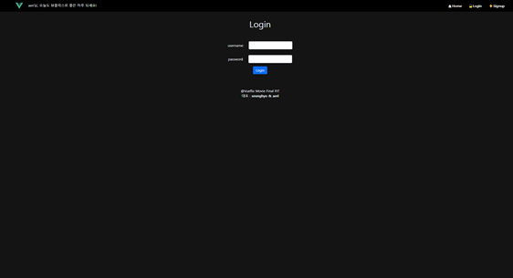

  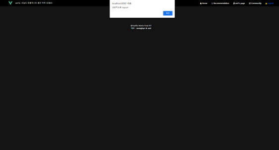

  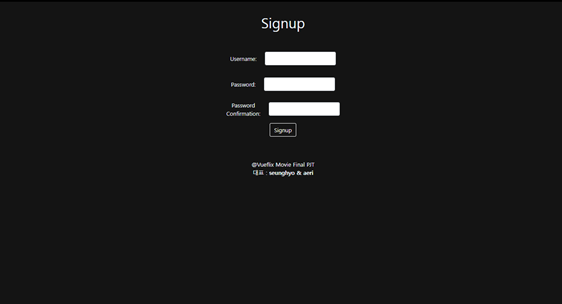

  => 로그인 / 로그아웃 / 회원가입 기능 구현

- Movies

  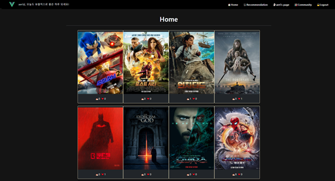

  => Popularity를 기반으로 상위 20개의 영화 추천
  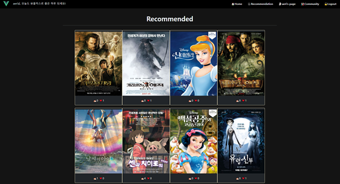

  => 유저들의 영화 좋아요 + 장르 싫어요 기반으로 영화 추천 알고리즘 구현
  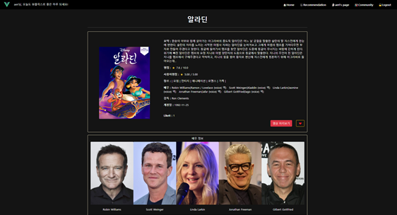

  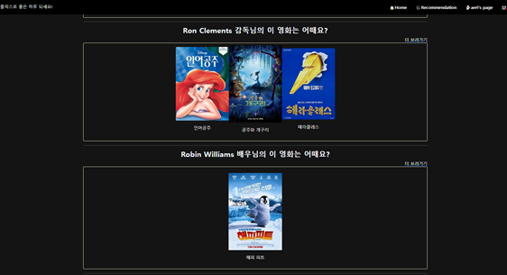

  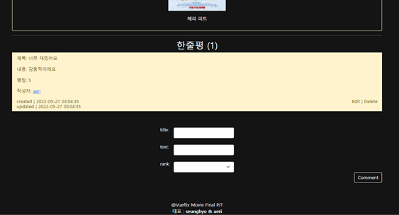

  => movie detail 페이지
  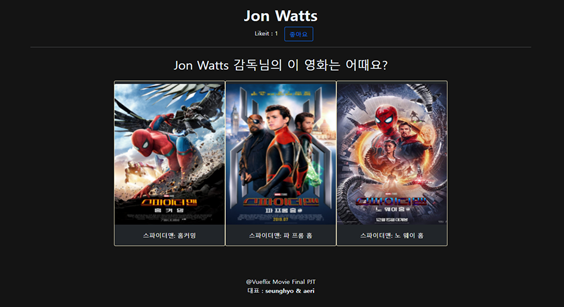

  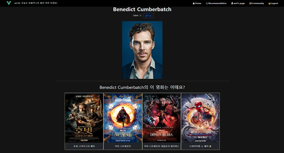

  => 감독별 배우별 추천 알고리즘

- Profile

  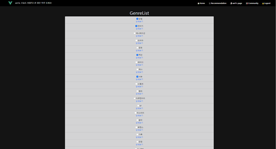

  => 장르 싫어요 ( 비선호 장르 선택 기능 )

  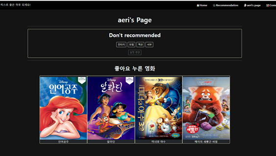
  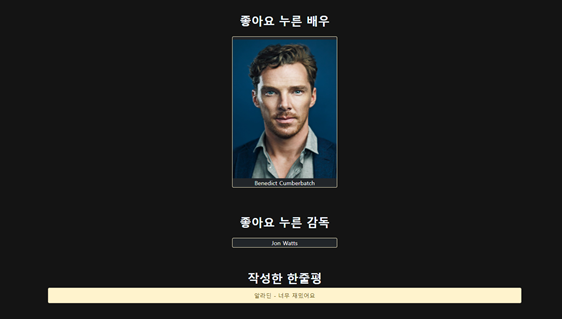

  => 좋아요 누른 영화 / 배우 / 감독 / 내가 작성한 한줄평

- Community

  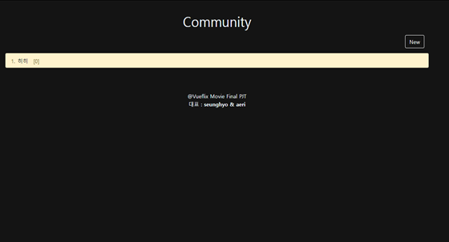

  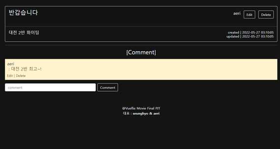

  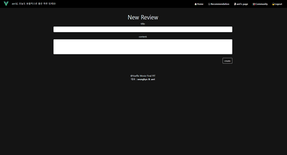

  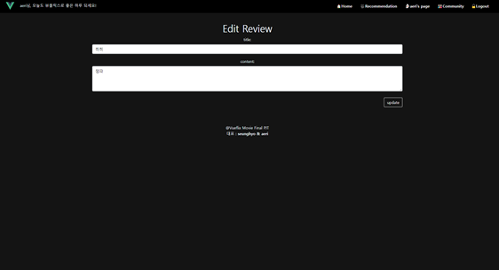
  => CRUD 구현

- 추천 알고리즘 설명

  ```
  개인 프로필페이지에 제공되는 비선호 장르 선택창과 각 영화에 제공되는 좋아요 버튼을 통해 Genre Score에 장르별 점수를 부여합니다. 싫어하는 장르에는 음수값을 부여하고, 각 영화에 좋아요를 누르면 해당 영화의 장르에 각각 점수가 누적됩니다. 이 때 좋아요를 누른 영화에 비선호 장르가 포함된다면 점수부여를 따로 해주지는 않습니다. 이후 각 영화가 가지는 장르의 점수를 각각 합산해주고 장르 스코어가 높은 순서대로 상위 20개를 목록에 추천해줍니다. 예를 들어서 말씀을 드리면 닥터 스트레인지 영화가 가지는 장르는 모험, 판타지, 액션입니다. 만약 제가 모험에 비선호 장르를 설정을 해뒀다면 비선호 장르에는 임의의 음수값이 부여가 되고, 판타지와 액션에는 점수가 플러스 되어 합산되는 형식입니다.
  ```

  ```
  프로필에서 좋아요를 누른 배우별 감독별 영화 추천을 제공합니다.
  ```

  

### 5. 배포 서버 URL

-

### 6. 일자별 기록

#### Day 1 - 220517

- social login 구현 - 내일 수업 들은 다음에 검증해보기
- dumpdata 받아오기 - create를 이용하여 json 파일로 받아오긴 했는데 1)리스트가 제대로 닫혀 있지 않는 문제, 2)원하는 데이터값을 받아오지 못하는 문제, 3)인코딩 에러 발생
  => context 들여쓰기 위치 문제로 정상적인 리스트로 받아옴.
  => 장르를 역참조해서 받아오는 방법을 생각해야할 것 같음 - 내일 다시 연구해보기
  => 인코딩 에러 해결 코드를 입력해줘도 해결되지 않음 - 내일 다시 연구해보기

#### Day 2 - 220518

- dumpdata 받아오기 - 계속 FK Error와 genre.set을 권고하는 메시지가 뜸.

  - 딕셔너리로 받아올 때,

  ```
  django.db.utils.IntegrityError: FOREIGN KEY constraint failed
  ```

  - create 할 때,

  ```
  direct assignment to the forward side of a many-to-many set is prohibited. use genres.set() instead.
  ```

  => 장르를 역참조해야 하는데 장르가 없어서 역참조해줄 대상이 없었다. 장르 데이터와 동시에 받아주어 에러 해결
  => 인코딩 에러 해결 코드를 입력해줘도 해결되지 않음 : ansure_ascii=False 옵션으로 해결

- dumpdata 받으면서 ERD를 수정해야함을 알고 ERD 새로 수정해주었다.

- dumpdata : {

  ​	MovieData => (NowPlayingMovie, PopularMovie, UpcomingMovie), 
  ​	NtoM => Genres, 
  ​	Serializers에서 처리해줄 데이터 => (Actors, Directors)
  }
  => actors와 directors가 전체 영화 DB에 존재하지 않아서 관계설정에 어려움을 겪음. 
  ==> MovieData에 임의로 빈 공간을 넣어준 다음 credit에서 필요한 필드만 받아와 append 해주며 해결.
  ==> but, MovieData와 Serializers 처리해줄 데이터를 합치는 과정에서 fixtures가 잘 되지 않음.

- vue 응용 강의 다시보기

#### Day3 - 220519

- test - dumpdata 받기 완료 : PopularMovie, Genres, Actors, Directors
- django serializer 코드 짜기
  - movies부터 comment까지 postman으로 테스트하면서 데이터 구성해주었다.
    => comment 수정과 삭제에서 오류가 남. 내일 해결하기로 함

#### Day4 - 220520

- django serializer 마무리 : model 관계설정 단어 오류 해결

  ```
  - django.core.exceptions.ImproperlyConfigured: Field name `movies` is not valid for model `Review`.
  ```

  => 역참조 관계명을 가져오는 부분에서 잦은 실수를 함. models.py 를 보면서 관계를 확인하면서 수정

- Vue - django 서버 연결하기

- Vue 메인페이지 구현에서 created에 설정했던 fetchmovies 함수와 movies가 undefined 됐다는 오류(console에서 확인)와 duplicate 오류 발생

  ```
  unknown action type: fetchmovies
  unknow getters type: movies
  
  duplicate getter key:account / ...
  ```

  => moduls 파일에 분리해뒀던 movies.js 를 index.js에 추가하지 않아서 발생한 오류였다. index.js에 movies 추가해주며 unknown 현상 해결. 이 과정에서 휴먼에러로 인해 duplicate 오류 발생.

  ```
  import movies from './modules/accounts'
  ```

  => accounts로 적은 부분을 movies로 고쳐주면서 dulplicate 해결
  
- login / logout / signup 구현 완료 (social login 제외)

- main 페이지에 popular movie 상위 10개 띄우기 완료 - 추후 알고리즘 구현 후 보완 예정

#### Day5 - 220521

- 시작 전 진행상황

  > <b>back</b>

  - dumpdata 완료
  - serialization 완료
  - server - client 연결

  > front

  - login / logout / signup 구현 완료
  - popular movie 메인페이지에 데이터 로드하기 완료(detail x)

  > postman으로 확인 가능한 부분

  - [POST] http://127.0.0.1:8000/api/v1/accounts/login - 로그인
  - [POST] http://127.0.0.1:8000/api/v1/accounts/logout - 로그아웃
  - [POST] http://127.0.0.1:8000/api/v1/accounts/signup - 회원가입
  - [GET] http://127.0.0.1:8000/api/v1/movies -무비리스트(전체)
  - [GET] http://127.0.0.1:8000/api/v1/movies/actor - 출연배우(전체)
  - [GET] http://127.0.0.1:8000/api/v1/movies/director/1 - 감독(한명씩)
  - [GET / POST] http://127.0.0.1:8000/api/v1/community/ - 자유게시판 목록 조회 및 생성 (+ 댓글목록)
  - [GET / PUT / DELETE] http://127.0.0.1:8000/api/v1/community/1/ - 자유게시판 디테일 조회 수정 삭제
  - [POST] http://127.0.0.1:8000/api/v1/community/1/comments/ - 자유게시판 디테일에 달린 댓글 목록 생성
  - [DELETE / PUT] http://127.0.0.1:8000/api/v1/community/1/comments/1/ - 자유게시판 디테일에 달린 댓글 개별 수정/삭제

- git pull을 받았는데 push를 잘못해버려서 git clone을 다시 받게 되었다. 그리고 서버 실행을 시켰는데 accounts를 제외하고 200은 뜨는데 데이터가 안떠서 당황스러웠다. 삽질 엄청 하다가 로드데이터 안한거 깨닫고 로드데이터 받은 후 시작..ㅠㅠ

- community 게시판 생성

  ```
  [ERROR] Component name "Community" should always be multi-word
  ```

  => export default 의 name을 그냥 Community로 해주어서 발생한 오류로 CommunityList로 수정해주며 해결.

- community 내 review detail 구현 - comment까지 출력.

- community 내 comment 생성/수정/삭제
  comment를 달면 새로고침을 해줘야 댓글이 달렸음을 확인할 수 있었다.  => 이유를 모르겠음..ㅠㅠ axios에 console.log 찍어봐도 찍히는데 왜 안넘어가ㅠㅠ 내일 해결....하기...

- movie detail 구현
  moviePk가 계속 Undefined라고 나와서 drf부터 확인해봤다. => 이상 없음.
  메인페이지에서 movie를 찍어보고 id로 바꿔주며 해결

#### Day6 - 220522

- 구글링을 통해 Vue는 JavaSript의 한계로 인해 속성의 추가, 제거를 감지할 수 없다는 사실을 알게 되었다. Vue는 인스턴스 초기화 중 data 객체의 속성을 getter/setter로 변환하기 때문에 data 객체에 속성이 있어야만 변환하고 응답할 수 있다고 한다.
  => 재확인 해보니 코드 자체에는 문제가 없었음.
  => 장고 community의 views.py에서 delete를 하고 난 후 status를 status=status.HTTP_204_NO_CONTENT로 설정해놔서 url 변경이 일어남을 확인. ==> status 삭제.
  => review 객체 내 이름 설정을 하나 잘못해주었다. community_review로 설정해주어 해결

- movie detail에서 review(영화별 한줄평)를 comment 형식으로 넣어주고자 하였다. community의 comment와 동일한 방식으로 작업을 해주었는데도 불구하고 axios error가 났다. 6시간동안 구글링 하며 코드를 손봤는데 이유조차 모르겠다ㅠㅠ

- actors list 와 actor detail을 구현. => movie detail에서 actor detail로 넘어갈 수 있다.

- movie detail에서 actor별 출연작을 추천해준다 => 같은 링크의 params(moviePk)만 달라서 새로고침이 되지 않는 문제 발생.
  => `<router-view :key="$route.fullPath">`를 넣어줬음에도

  ```
  [Vue warn]: Duplicate keys detected: '1912381'. This may cause an update error.
  ```

  다음과 같은 에러가 뜬다.

#### Day7 - 220523

- 오류 - 

  ```
  The service worker navigation preload request was cancelled before 'preloadResponse' settled. If you intend to use 'preloadResponse', use waitUntil() or respondWith() to wait for the promise to settle.
  ```

  ```
  [Vue warn]: Duplicate keys detected: '11006'. This may cause an update error.
  ```

- movie detail 좋아요

- movie detail 감독별 영화 추천

- movie detail 사용자 별점 평균 

- 프로필 좋아요 누른 영화 배우 감독별 영화 추천 및 확인

- 배우별 감독별 영화 추천 => 디테일 페이지로 이동해서 전부 출력

- ~~social login 구현(ing)~~

#### Day8 - 220524

- 관리자계정 CRUD 구현 - ok
- social login 구현 - 나중에
- css - bootstrap 이용 예정
- 댓글, 포스트 작성 시각 및 수정 시각 표시하기 안했음;;
- 메인페이지 만듦 - 부트스트랩적용함
- my profile - genre - popular movie - actor - director serializer model 수정(장르 싫어요 기반 추천 알고리즘 준비사항)
- ~~Vutify파이 공부~~ => 추후 보완하면서 기능들을 적용시켜보며 공부할 예정이다....

- 장고 admin 구현

  

#### Day9 - 220525(계획)

- 현재 구조

유저가 로그인하고 나 이 장르 싫어 누르면 hate genres 리스트로 출력됨.

=> http://127.0.0.1:8000/api/v1/accounts/profile/admin/

장르 리스트에서 싫어요 누르는 행동이 [post]http://127.0.0.1:8000/api/v1/movies/genre/14/unlike/

추천x 장르 선택 폼 로드 -> 싫어요 체크 -> 체크된 데이터는 hate genre로 넘겨주기

==> 구현 완료

- 추천알고리즘 구현 마무리
  프로세스 : 각 데이터를 기반으로 장르스코어 합산하고 내림차순으로 20개 영화 추천(실시간 변동)
- ~~덤프 다시 받아 제대로~~
- ~~Vuetify 적용하기 꼭^^;;~~
- Bootstrap 적용
- recommendation algorithm 
- 싫어요 장르 / 좋아요 영화 기반 추천 알고리즘 구현
  -> views.py 구현 / 알고리즘에 따른 모델 재정의

```
genre 테이블에 정의되지 않은 이름이 들어가 axios 통신을 못하는 오류 -> ERROR 500 -> serializer fields 삭제
```


#### Day10 - 220526

```
CSS - signup / moviedetail_reviewform / community - form/list/item / genreselectform
serializer - moviedetail serializer 중 reviewserializer 부분에서 review 정의 오류 부분 수정
```

```
$attrs is readonly.
$listeners is readonly.
==> 오류가 아닌 Vue warn 부분. 오류가 남에도 돌아가고 있지만 무엇이 문제인지 잘 모르겠다. 
```

```
avoid mutating a prop directly since the value will be overwritten whenever the parent component re-renders. instead, use a data or computed property based on the prop's value. prop being mutated: "to"

the service worker navigation preload request was cancelled before 'preloadresponse' settled. if you intend to use 'preloadresponse', use waituntil() or respondwith() to wait for the promise to settle.

vue.runtime.esm.js?c320:1897 typeerror: cannot read properties of undefined

=> 비동기 처리 순서를 거치면서 오류가 생긴 듯 하다. 같은 반 교육생의 도움으로 vue의 router 링크 순서를 바꿔주었다 => (moviedetail 부분에서 계속 오류가 났기 때문에, moviedetail <-> recommend 위치 변경)
```

```
moviedetail에서 쓴 review의 작성자와 edit 버튼이 눌리지 않음 -> serializer오류로 username이 포함되지 않았음 
vue에서 해당 데이터 확인 후 serializer 수정
```

```
duplicated key error -> 키값에러가 났다. name으로 지정한 key값을 중복되지 않게 문자열을 추가해주며 변경 !
```

- 오류 수정으로 최종 프로젝트 마무리.

  =) 이후 추가적인 기능 구현예정.

#### Day 11 - 220527 (최종 발표)


### 7. 느낀 점

- 고승효 : 

  ```
  프로젝트 시작 전부터 어떤 기능을 어떤식으로 구현할지에 대한 이야기를 많이 했다. 처음 구상하고 구현하고자 했던 내용들 중에서 남은 시간과 타협하며 할 수 있을법한 기능들을 정하는 과정에서 기간이 좀만 더 있었더라면 이라는 생각을 가장 많이 하게 되었던 것 같다. 초반 구상 시점에서 이야기가 나왔던 것 중에 시각 장애인을 위한 기능을 추가하자는 의견을 냈었는데, 필수 기능들부터 구현하는게 우선순위가 높았기 때문에 시간이 남으면 하기로 정하고 시작하였다. 최소 기능 위주로 시작하면서도 생각만큼 빠르게 진행이 되지 않아서 중간 중간 오류 수정에 애를 많이 먹었는데, 최종 결과물이 그래도 나름의 결과를 낳은 것 같아서 그동안의 나와 페어의 노력이 보여지는 느낌이다. 방학 중까지 좀 더 공부하고 보완하는 시간을 가지면서 초기에 구현하려했던 기능들을 더 추가시켜볼 생각이고, 배포까지 해보는 것을 목표로 가지려 한다.
  1학기 중 배운 내용들을 토대로 해 본 프로젝트임에도 중간중간 고비가 있을 때마다 역시 복습이 가장 중요하고, 이론적인 부분 이외에도 실습을 꼭 스스로도 많이 해봐야겠다고 생각했다. 이제 이 프로젝트를 마지막으로 1학기를 마치게 되었고, 지나간 시간은 되돌릴 수는 없기 때문에 방학 중 1학기간의 내용을 좀 더 공부하고 2학기 프로젝트를 준비하여야겠다고 생각하는 시간이 된 것 같다.
  ```

- 김애리 : 

  ```
  처음에 기능별 구현을 제안했었는데, 진행하다보니 자연스럽게 백 쪽을 많이 구현하게 된 것 같습니다 ..
  맨 처음 프로젝트를 시작하면서 맨 땅에 헤딩하는 기분이었는데, 어느덧 완벽하게 기능을 구현하는 것을 보니 짧은 시간이지만 많은 성장을 했다고 생각합니다.
  serializer를 하면서 serializer 안에 새로운 serializer를 구현하는 방식들을 많이 접하면서 어떤 걸 보여주고, 어떻게 정의를 해야하는지 한 번 더 확인할 수 있는 계기가 되었습니다.
  또한 serializer에서 필드를 새로 만들어 views.py에서 계산값(annotate)을 넣어주는 작업을 다시 한 번 해보면서 serializer의 넓은 폭을 한 번 더 경험할 수 있었습니다.
  또한 Vue를 작업하면서 생각보다 프론트에서 신경을 쓸 부분이 많다는 것을 느꼈습니다. 받은 정보를 처리해서 사용자에게 보여주는 작업들이 많다보니 , 각각 어떤 결과를 가지고 와야할지 생각해야해서 많이 복잡했습니다.
  방학 동안 Vue와 Django를 좀 더 심화학습 (복습 필수)을 공부하며 2학기 프로젝트를 준비해야겠다고 생각했습니다. 
  일주일이라는 시간동안 좋은 페어를 만나서 많은 것을 배울 수 있던 좋은 경험이었습니다.
  ```

  

### 8. 기타 - 메모

DATA 받아오기 ( 초기 코드 )

```python
from django.shortcuts import render
import requests
from .models import Movie
# Create your views here.

def index(request):

    data = Movie()

    for page in range(21,51):
        url = "https://api.themoviedb.org/3/movie/top_rated?api_key=1084b2e96727cbe4bd9c2a0e2fd99168&language=ko&page="
        pageurl= url + str(page)

        response = requests.get(pageurl)
        data=response.json()
        print(response.status_code, response.url)
        movielist = data.get('results')
        # print(len(movielist))
        for i in range(20):
            if movielist[i].get('release_date'):
                data = Movie.objects.create(
                title = movielist[i].get('title'),
                release_date = movielist[i].get('release_date'),
                popularity = movielist[i].get('popularity'),
                vote_average = movielist[i].get('vote_average'),
                overview = movielist[i].get('overview'),
                backdrop_path = movielist[i].get('backdrop_path'),
                poster_path = movielist[i].get('poster_path'),
                )


    context = {

        "movies": movies 
    }
    return render(request, 'movies/index.html', context)
```

```
python manage.py dumpdata --indent 4 movies.movie > test.json
=> 4칸씩 띄어서 저장
```

- 배우별 영화 3개만 출력하기 (ing)

```html
<div v-for="movieactor in movie.actors" :key="movieactor.name">
      <div v-if="movieactor.popular_movies.length >= 2">
        <p>{{ movieactor.name }}의 이 영화는 어때요?</p>
        <div v-for="num in 3" :key="num">
          <!-- <div v-for="newmovie in movieactor.popular_movies" :key="newmovie.title"> -->
          <div v-if="movieactor.popular_movies[num].id != movie.id">
            <router-link
              :to="{ name: 'movie', params: { moviePk: movieactor.popular_movies[num].id } }"
            >
              
            </router-link>
            <p>{{ movieactor.popular_movies[num].title }}</p>
          </div>
            <!-- {{ movie.id }} -->
          <!-- </div> -->
        </div>
      </div>
    </div>
```

is_staff : 관리자 여부 확인

allauth

- 네브바 확인하기ㅠㅠ

```html
	<ul>
      <li>
        <router-link :to="{ name: 'movies' }">Home</router-link>
      </li>
      <li v-if="!isLoggedIn">
        <router-link :to="{ name: 'login' }">Login</router-link>
      </li>
      <li v-if="!isLoggedIn">
        <router-link :to="{ name: 'signup' }">Signup</router-link>
      </li>
      <!-- <li v-if="isLoggedIn">
        <div v-if="is_staff">
          <router-link :to="{ name: 'admin' }">admin</router-link>
        </div>
      </li> -->
      <li v-if="isLoggedIn">
        <router-link :to="{ name: 'actors' }">actors</router-link>
      </li>
      <li v-if="isLoggedIn">
        <router-link :to="{ name: 'profile', params: { username } }">
          {{ currentUser.username }}'s page
        </router-link>
      </li>
      <li v-if="isLoggedIn">
        <router-link :to="{ name: 'community' }">
          Community
        </router-link>
      </li>
      <li v-if="isLoggedIn">
        <router-link :to="{ name: 'logout' }">Logout</router-link>
      </li>
    </ul>
```

싫어요 

```
	<ul>
      <li v-for="movie in movies" :key="movie.id">
        <router-link :to="{ name: 'movie', params: { moviePk: movie.id } }">
          {{ movie.title }}
        </router-link>
        ✍🏻{{ movie.review_count }}
        💓{{ movie.like_count }}
      </li>
    </ul>
  </div>
```

- 덤프 다시 뜨기 ( 추후에 )
  => upcoming 100개
  => Now Playing 500개 데이터 추가로 받아서 적용해보기
- 


