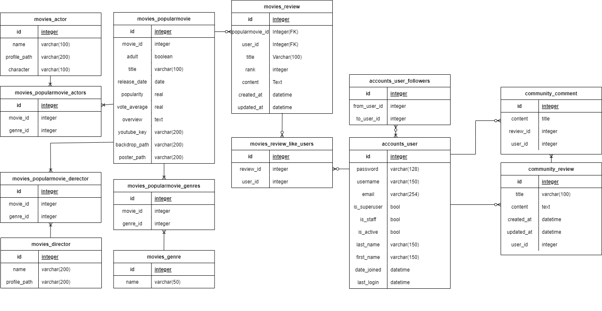

# 최종관통프로젝트

### 개요

- final-pjt 제출주소
  https://lab.ssafy.com/shko0524/final-pjt.git
- Trello management
  https://trello.com/b/Agl03LfX/final-pjt

- 개발환경
  - Python 3.8 +
  - Django 3.2.12
  - Node LTS
  - Vue.js 2.6+
  - Django REST API 서버 & Vue.js
- 프로젝트 기간
  - 2022. 5. 17. (화) ~ 
                 2022. 5. 26. (목)
  - 발표 : 2022. 05. 27. (금)
- 필수 기능
  - 관리자 뷰
    - 영화 CRUD
    - 유저 관리
  - 영화 정보
    - DB Seeding ( 50개 이상 )
    - 영화 평점 CRUD
  - 영화 추천 알고리즘
    - 팀별 자유 알고리즘
  - 커뮤니티
    - 게시글, 댓글 CRUD ( 생성시간, 수정시간 필수 )
  - 기타
    - 최소 5개 이상의 URL 및 페이지 구성
    - HTTP Method / HTTP response status codes 적절히 구성

----

### 0.

### 1. 팀원 정보 및 업무 분담 내역

<table>
    <tr>
    	<th style="text-align:center">고승효</th>
        <th style="text-align:center">김애리</th>
    </tr>
    <tr>
    	<td>
        	
        </td>
        <td>
        	
        </td>
    </tr>
    <tr>
        <td colspan="2" style="text-align:center">
        공통 작업
    </td>
    </tr>
    <tr>
        <td colspan="2" style="text-align:center">
        serializer 구현
        </td>
    </tr>
    <tr>
        <td>
            팀장<br />social login 구현
        </td>
        <td>
            dumpdata 받아오기 (TMDB)
        </td>
    </tr>
    <tr>
        <td colspan="2" style="text-align:center">
            프론트엔드 구현
        </td>
    </tr>
    <tr>
        <td>
            명세 필수 기능 구현 - 
        </td>
        <td>
            명세 필수 기능 구현 - 로그인/로그아웃/signup<br>
            명세 필수 기능 구현 - popularmovie 상위 10개 main 페이지에 띄우기
        </td>
    </tr>
    <tr>
        <td colspan="2" style="text-align:center">
            백엔드 구현
        </td>
    </tr>
    <tr>
        <td>
            ...
        </td>
        <td>
            ...
        </td>
    </tr>
</table>

### 2. 목표 서비스 구현 및 실제 구현 정도

#### - 목표 서비스

- 소셜 로그인 구현 (google, kakao, naver)
- 영화 정보 기반 추천 서비스★
  - 최초 로그인 시 추천 받기 싫은 영화 장르를 먼저 선택하고, default값 음수로 변경.
  - 이후 내가 본 영화를 기반으로 좋아요를 누르면 장르별로 점수 차등 부여하여 영화 추천. 
- 커뮤니티 - 자유게시판 형식

#### - 구현

- 가상환경 생성 및 활성화

  ```bash
  $ python -m venv venv
  $ source venv/Scripts/activate
  ```

- requirment.txt 설치

  ```bash
  $ pip install -r requirment.txt
  ```

- 모델 생성 및 migration & migrate

  ```bash
  $ python manage.py makemigrations
  $ python manage.py migrate
  ```

- dumpdata 및 loaddata

  ```bash
  $ python -Xutf8 manage.py dumpdata --indent 4 movies.actor > actor.json
  $ python -Xutf8 manage.py dumpdata --indent 4 movies.derector > derector.json
  $ python -Xutf8 manage.py dumpdata --indent 4 movies.genre > genre.json
  $ python -Xutf8 manage.py dumpdata --indent 4 movies.popularmovie > popularmovie.json
  
  $ python manage.py loaddata movies/actors.json movies/derector.json movies/genre.json
  $ python manage.py loaddata movies/popularmovie.json
  ```

### 3. 데이터베이스 모델링 (ERD)



### 4. 필수 기능에 대한 설명


### 5. 배포 서버 URL


### 6. 일자별 기록

#### Day 1 - 220517

- social login 구현 - 내일 수업 들은 다음에 검증해보기
- dumpdata 받아오기 - create를 이용하여 json 파일로 받아오긴 했는데 1)리스트가 제대로 닫혀 있지 않는 문제, 2)원하는 데이터값을 받아오지 못하는 문제, 3)인코딩 에러 발생
  => context 들여쓰기 위치 문제로 정상적인 리스트로 받아옴.
  => 장르를 역참조해서 받아오는 방법을 생각해야할 것 같음 - 내일 다시 연구해보기
  => 인코딩 에러 해결 코드를 입력해줘도 해결되지 않음 - 내일 다시 연구해보기

#### Day 2 - 220518

- dumpdata 받아오기 - 계속 FK Error와 genre.set을 권고하는 메시지가 뜸.

  - 딕셔너리로 받아올 때,

  ```
  django.db.utils.IntegrityError: FOREIGN KEY constraint failed
  ```

  - create 할 때,

  ```
  direct assignment to the forward side of a many-to-many set is prohibited. use genres.set() instead.
  ```

  => 장르를 역참조해야 하는데 장르가 없어서 역참조해줄 대상이 없었다. 장르 데이터와 동시에 받아주어 에러 해결
  => 인코딩 에러 해결 코드를 입력해줘도 해결되지 않음 : ansure_ascii=False 옵션으로 해결

- dumpdata 받으면서 ERD를 수정해야함을 알고 ERD 새로 수정해주었다.

- dumpdata : {

  ​	MovieData => (NowPlayingMovie, PopularMovie, UpcomingMovie), 
  ​	NtoM => Genres, 
  ​	Serializers에서 처리해줄 데이터 => (Actors, Directors)
  }
  => actors와 directors가 전체 영화 DB에 존재하지 않아서 관계설정에 어려움을 겪음. 
  ==> MovieData에 임의로 빈 공간을 넣어준 다음 credit에서 필요한 필드만 받아와 append 해주며 해결.
  ==> but, MovieData와 Serializers 처리해줄 데이터를 합치는 과정에서 fixtures가 잘 되지 않음.

- vue 응용 강의 다시보기

#### Day3 - 220519

- test - dumpdata 받기 완료 : PopularMovie, Genres, Actors, Directors
- django serializer 코드 짜기
  - movies부터 comment까지 postman으로 테스트하면서 데이터 구성해주었다.
    => comment 수정과 삭제에서 오류가 남. 내일 해결하기로 함

#### Day4 - 220520

- django serializer 마무리 : model 관계설정 단어 오류 해결

  ```
  - django.core.exceptions.ImproperlyConfigured: Field name `movies` is not valid for model `Review`.
  ```

  => 역참조 관계명을 가져오는 부분에서 잦은 실수를 함. models.py 를 보면서 관계를 확인하면서 수정

- Vue 메인페이지 구현에서 created에 설정했던 fetchmovies 함수와 movies가 undefined 됐다는 오류(console에서 확인)와 duplicate 오류 발생

  ```
  unknown action type: fetchmovies
  unknow getters type: movies
  
  duplicate getter key:account / ...
  ```

  => moduls 파일에 분리해뒀던 movies.js 를 index.js에 추가하지 않아서 발생한 오류였다. index.js에 movies 추가해주며 unknown 현상 해결. 이 과정에서 휴먼에러로 인해 duplicate 오류 발생.

  ```
  import movies from './modules/accounts'
  ```

  => accounts로 적은 부분을 movies로 고쳐주면서 dulplicate 해결

#### Day5 - 220521


### 7. 느낀 점

- 고승효 : 
- 김애리 : 


DATA 받아오기

```python
from django.shortcuts import render
import requests
from .models import Movie
# Create your views here.

def index(request):

    data = Movie()

    for page in range(21,51):
        url = "https://api.themoviedb.org/3/movie/top_rated?api_key=1084b2e96727cbe4bd9c2a0e2fd99168&language=ko&page="
        pageurl= url + str(page)

        response = requests.get(pageurl)
        data=response.json()
        print(response.status_code, response.url)
        movielist = data.get('results')
        # print(len(movielist))
        for i in range(20):
            if movielist[i].get('release_date'):
                data = Movie.objects.create(
                title = movielist[i].get('title'),
                release_date = movielist[i].get('release_date'),
                popularity = movielist[i].get('popularity'),
                vote_average = movielist[i].get('vote_average'),
                overview = movielist[i].get('overview'),
                backdrop_path = movielist[i].get('backdrop_path'),
                poster_path = movielist[i].get('poster_path'),
                )


    context = {

        "movies": movies 
    }
    return render(request, 'movies/index.html', context)
```

```
python manage.py dumpdata --indent 4 movies.movie > test.json
```

